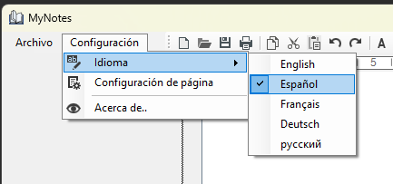
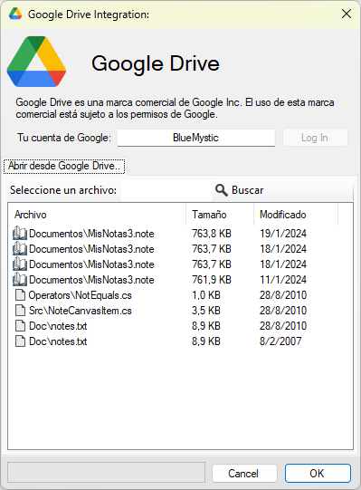

# MyNotes
A hierarchical notepad to store everything you want almost like a book.

Translated to 5 Languages: EN, ES, DE, FR, RU

Optional Integration with Google Drive, you can automatically store your documents in the Cloud and acces them from anywhere!

And much more..

## Requirements

Microsoft .NET Framework version 4.8 or newer. If you are on Windows 10+, you may already have it. 
If you don't have it installed yet, you can get it [here](https://dotnet.microsoft.com/download/dotnet-framework/net8).

## Installation

* Download the latest `MyNotes3_vX.XX.zip` file from the [releases page](https://github.com/BlueMystical/MyNotes/releases/latest).
* Unzip it anywhere you want in your PC.
* Run the EXE.
